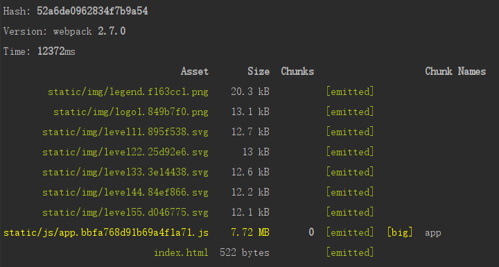
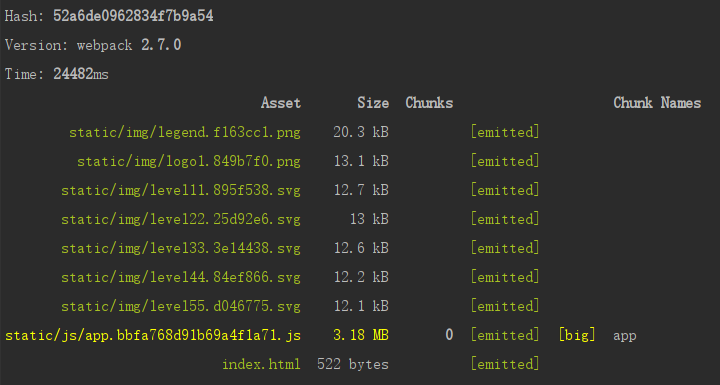
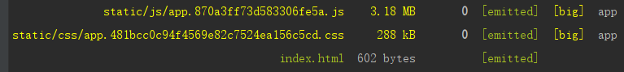
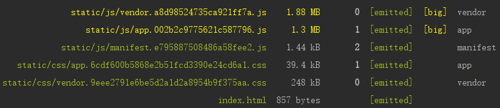
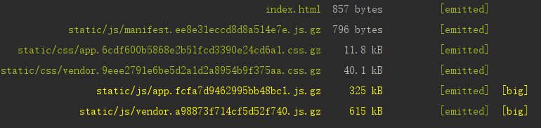

	webpack优化是为了加快项目的构建速度、发布后用户的体验。以之前实习参与的的一个项目的来做优化实验。

#### 		1、UglifyJsPlugin

uglifyjs是用来压缩js代码的插件，是最常用的插件之一。`node` 版本>=6.9.0，`webpack`版本>=v4.0.0。之前为`webpack.optimize.UglifyJsPlugin`。



没使用uglifyjs之前，可以看到app.js文件大小达到了7.72MB。使用uglifyjs进行js代码压缩，结果如下：



虽然构建时间大大增加了，但是app.js的体积也大大减少了，有利于发布后，用户的加载速度。

#### 2、ExtractTextPlugin

​		可以看到，上面的构建文件中并没有css文件，原因是css文件被打包在了js文件之中了。这样的话，样式要在js文件加载完成之后，才会被渲染出来，体验较差。ExtractTextPlugin可以将css文件从js文件中分离出来。

​		`new ExtractTextPlugin({filename: utils.assetsPath('css/[name].[contenthash].css'), allChunks: true}),`



可以看到css被单独分离出来了，打开index.html可以看到css标签在head标签之中。

#### 3、CommonsChunkPlugin

​		app.js现在体积还是很大，因为其中包含的不仅仅只有业务代码，还有node_modules里面依赖包的代码。并且如果某些模块引入了同一个模块，还会造成重复打包的问题。CommonsChunkPlugin可以将公共代码提取出来，将依赖包和业务代码分离开。

```
new webpack.optimize.CommonsChunkPlugin({
   name: "vendor",
   minChunks: function (module) {
     return module.context && module.context.includes("node_modules");
   }
}),

new webpack.optimize.CommonsChunkPlugin({
   name: 'manifest',
}),
```



依赖包代码和业务代码已经分离出来。业务代码大小以及降到了1.3M。

#### 4、HashedModuleIdsPlugin

​		在项目开发时，我们进行修改的都是业务代码，依赖包的代码基本很少变动，但是打包时可以发现，尽管依赖包代码没有改变，但每次文件名还是变了。导致这个结果的原因在于，由于引入了一个新模块，使得打包过程中部分模块的模块ID发生了改变。而模块ID的改变，直接导致了包含这些模块的chunk内容改变，进而导致chunkHash的改变。这样无法有效的利用缓存，明明vendor代码没有变，但是每次发布后，用户还是会发起新的请求。HashedModuleIdsPlugin会根据模块的相对路径生成一个四位数的hash作为模块id。避免了依赖包没有改变，还生成新的vendor文件的问题。

#### 5、compression-webpack-plugin

​		将css、js文件进行gzip压索可以进一步压缩代码体积。

```
new CompressionWebpackPlugin({
  asset: '[path].gz[query]',
  algorithm: 'gzip',
  test: new RegExp(
    '\\.(' +
    config.build.productionGzipExtensions.join('|') +
    ')$'
  ),
  threshold: 0,
  deleteOriginalAssets: true,
  minRatio: 0.8
})
```



可以看到，业务代码已经压缩到了325kB。gzip需要对nginx进行相应的配置

	gzip on;  
	gzip_min_length 0k;
	gzip_comp_level 4;  
	gzip_buffers 4 16k;  
	gzip_http_version 1.1;
	gzip_static on;
	gzip_types text/plain text/css application/json application/javascript text/xml application/xml application/xml+rss text/javascript;

相应的配置可以到nginx官网查询。webpack层面的优化到这里就结束啦。这里的配置是基于webpack2.7的，因为项目创建的时间较早，没有进行相应的迁移，在webpack4中，配置方式可能由略微不同，但是优化思路是一样的。